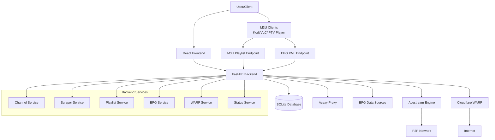
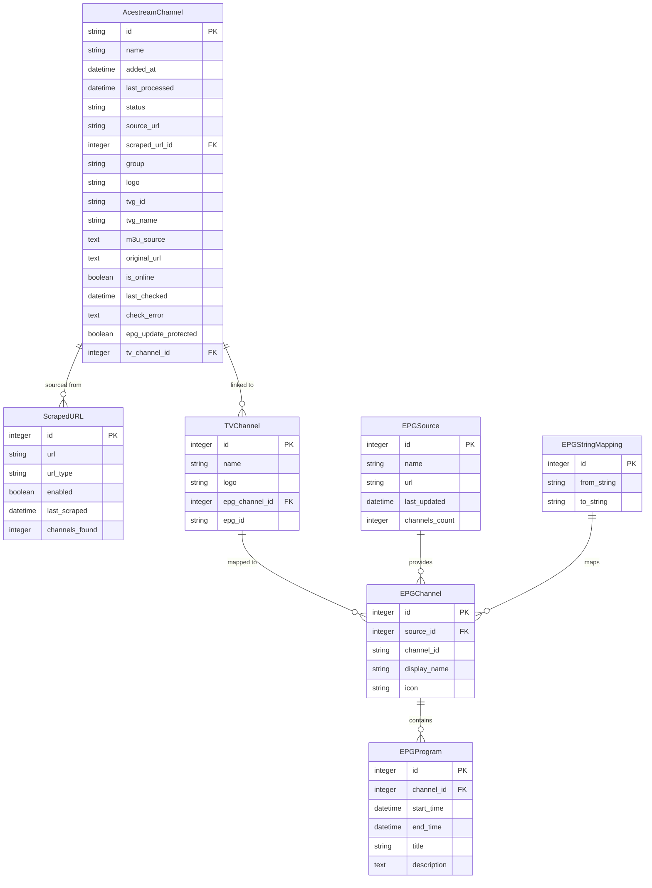
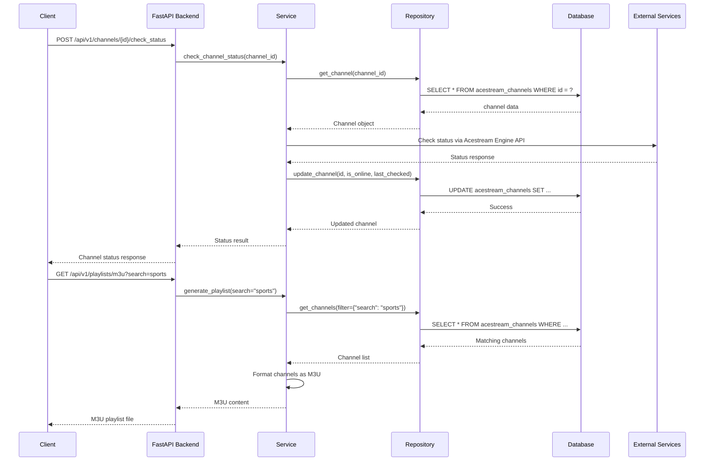
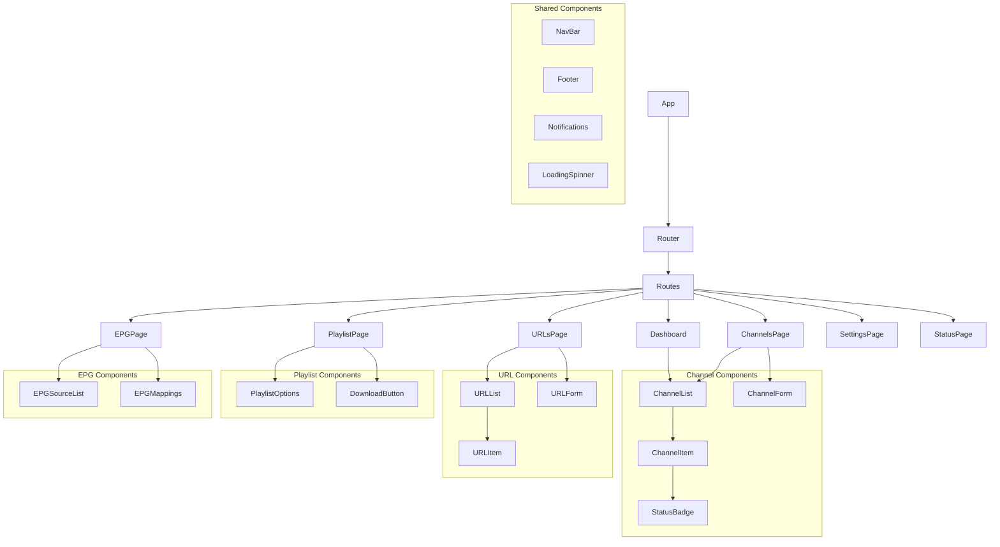
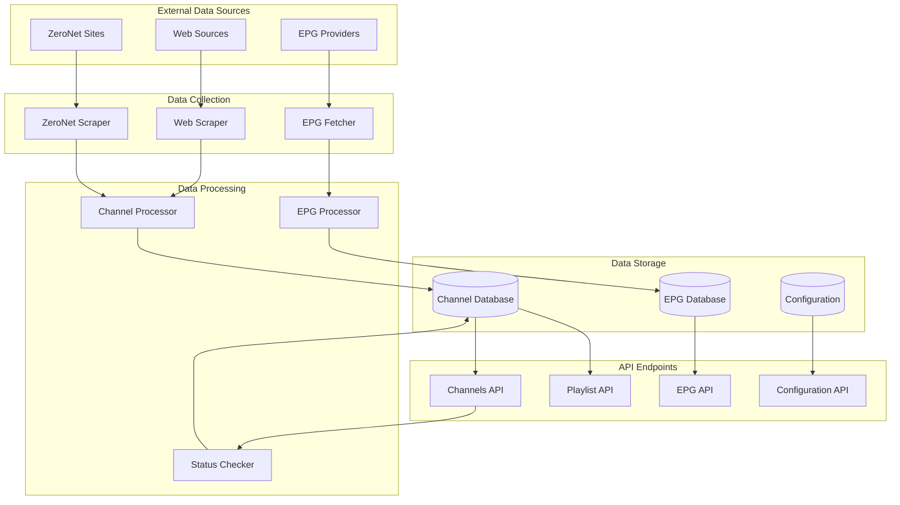

# Architecture Diagrams

This document provides visual representations of the Acestream Scraper architecture to help with the rewrite process.

## System Architecture

## Database Entity Relationship Diagram

## API Flow Diagram

## Frontend Component Structure

## Data Flow Diagram

These diagrams should help visualize the complex relationships and workflows in our application, making it easier to understand the architecture during the rewrite process.
